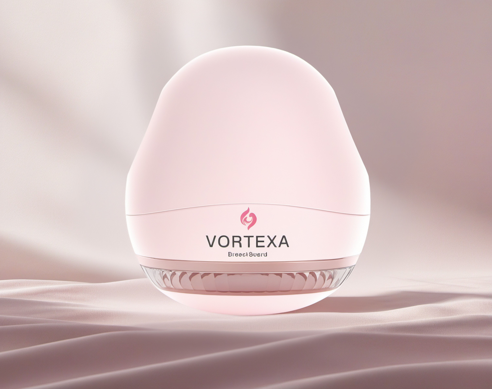
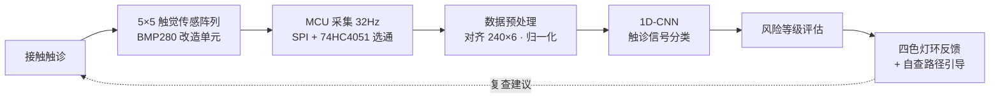
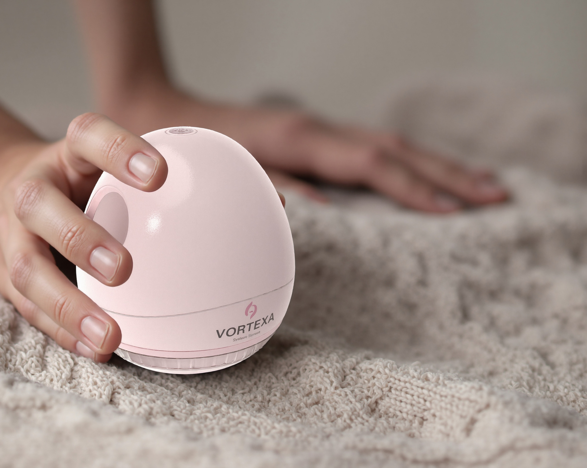
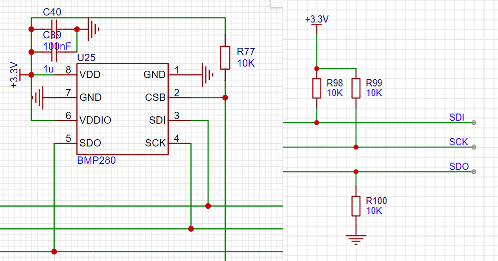
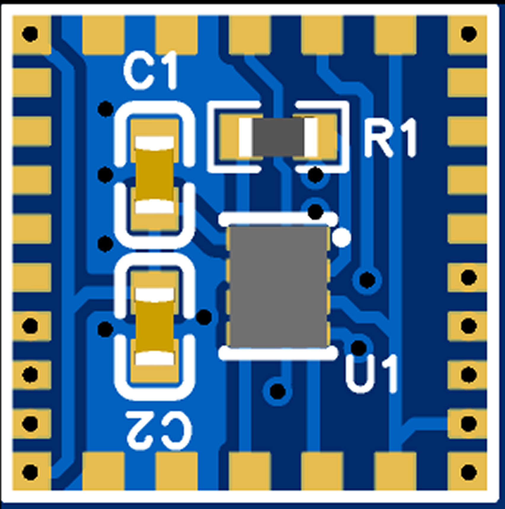
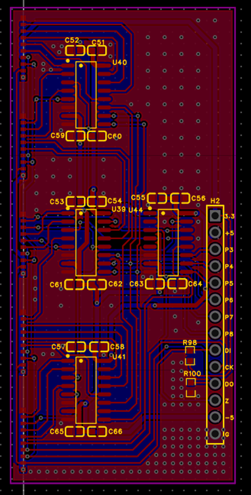
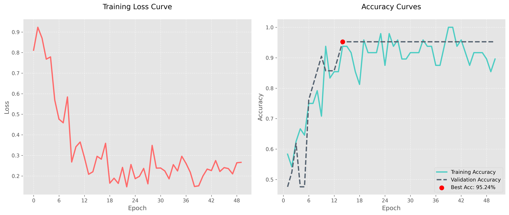

# VORTEXA · BreastGuard

**基于触觉传感的家庭乳腺健康自查设备**

*Tactile Sensing × Industrial Design × Deep Learning — Health care at your fingertips*

  

 

一款覆盖 **设计调研 → 产品定义 → 传感硬件 → 电路系统 → AI 算法 → 原型验证** 的全链路独立作品：
以工业设计方法论驱动产品定义，以硬件改造与电路攻关筑牢工程底座，以算法工程闭合「感知 — 识别 — 反馈」回路。

---

## 目录

[项目概览](#项目概览) · [工作量全景](#工作量全景) · [系统架构](#系统架构) · [设计研究](#设计研究) · [形态推演与产品设计](#形态推演与产品设计) · [触觉传感硬件](#触觉传感硬件) · [阵列与电路工程](#阵列与电路工程) · [AI 触诊识别算法](#ai-触诊识别算法) · [关键成果一览](#关键成果一览) · [展板](#展板)

---

## 项目概览

乳腺癌是全球女性高发恶性肿瘤（2020 年全球新增约 230 万例，占女性新发癌症约 11.7%），早期发现是提升生存率的关键。传统徒手自查主观、漏检率高；专业筛查依赖设备与医师、可及性差——家庭场景长期缺乏一款「准确、易用、低成本、有反馈」的科学自查工具。

VORTEXA 的回答是一颗掌心大小的「粉色鹅卵石」：

- **感知** —— 由 25 个 BMP280 MEMS 气压计改造的力触觉单元组成 5×5 蜂窝阵列，随手掌按压采集乳腺组织的硬度 / 弹性时序信号；
- **识别** —— 自研 1D-CNN 对触诊时序信号做异常识别，二分类准确率 95.24%；
- **反馈** —— 四色 RGB 灯环完成路径引导、压力提示与结果反馈，全流程不超过 3 次交互。

把自查从「经验判断」推向「智能评估」，同时以「去医疗化」的设计语言让健康自查像日常护肤一样轻松。

## 工作量全景

| 模块 | 主要工作 | 关键产出 |
|---|---|---|
| 设计调研 | 3 类利益相关者深度访谈；问卷设计与投放；6 款竞品三维定量评分与散点建模 | 100 份有效问卷；竞品评分矩阵；市场空白定位 |
| 形态设计 | 握持手势研究；草图发散；Stable Diffusion LoRA 意向图批量生成与关键词迭代；Rhino 精细建模；渲染与 CMF | 4 大风格方向；掌心式最终方案；整套效果图与 CMF 规范 |
| 结构验证 | 3 种曲率壳体 3D 打印；软 / 硬曲面力传导对比实测；触诊区结构选型 | 「中低曲率 + 中高硬度 + TPU 表面」结构结论 |
| 传感单元 | 25+ 颗 BMP280 去壳改造与硅胶封装；三明治传力结构 3 轮迭代；2 种硅胶 × 3 种 TPU 硬度组合砝码标定 | 线性度约 98%；标定 R² 最高 0.994；Shore 30 硅胶选型 |
| 电路系统 | 面包板 1×1 → 5×5 五级渐进扩阵；选通电路 4 次方案迭代；软硬结合 PCB（单元板 / 纵横排线 / 逻辑板共 5 部分）设计与打样 | 25 路稳定选通；32Hz 实时采样；可量产 PCB 文件 |
| AI 算法 | 数据清洗对齐 pipeline；ResNet-18 迁移学习基线；自研 1D-CNN 网络与训练引擎 | 二分类准确率 52% → 95.24%；15 epoch 收敛 |

## 系统架构

## 设计研究

研究遵循「发散 — 收敛」双钻思路，按 **调研分析 → 产品定义 → 设计实践 → 测试验证** 四阶段推进，并预留动态修正空间。

**竞品三维定量评分**（技术性能 / 用户交互 / 医疗适配性，1–5 分）：

| 类别 | 竞品 | 技术性能 | 用户交互 | 医疗适配 |
|---|---|:---:|:---:|:---:|
| 非触觉 | cUSBr-Patch 可穿戴超声贴片 | 3 | 3 | 3 |
| 非触觉 | iSono ATUSA 便携自动化超声 | 4 | 3 | 3 |
| 非触觉 | iTBra 温度传感内衣 | 2 | 4 | 2 |
| 触觉 | SureTouch 触觉成像探头 | 3 | 4 | 3 |
| 触觉 | Dotplot 超声 + 触摸传感 | 3 | 3 | 4 |
| 触觉 | iBreastExam 手持压力热成像 | 3 | 4 | 2 |

将评分映射到三维散点图后发现：「触觉式 + 高用户交互 + 中高医疗适配」象限存在**市场空白**——多数触觉竞品技术性能中等、医疗适配偏弱。由此确立产品定位：**手持式、低成本、强反馈、面向家庭的智能触觉自查设备**。

**四条贯穿全程的设计约束**：

| 设计约束 | 内涵 |
|---|---|
| 去医疗化 | 看起来像日常用品而非医疗设备，消解「过度医疗感」带来的心理压力与价格门槛 |
| 情感化 | 肤感粉色、圆润有机形态、亲肤材质，传达温暖、私密、安全 |
| 隐私关怀 | 面向卧室 / 浴室私密场景，外观自然融入家居、便于随时取用与收纳 |
| 碎片化适配 | 全流程不超过 3 次交互、盲触识别、一键启动，契合碎片化生活 |

## 形态推演与产品设计

形态推演被做成一条可追溯的「漏斗」：**握持手势研究 → 市售握持产品 / 美容仪造型调研 → 草图发散 → AIGC 意向推导（Stable Diffusion LoRA 批量生成 + 关键词迭代）→ 四大风格收敛（直立式 / 手持式 / 流线型 / 掌心式）→ Rhino v8 建模 → 曲面曲率 × 硬度实测 → 效果图与 CMF**。每一步都为下一步收敛提供依据，而非凭直觉「画个好看的」。

最终选定**掌心握持式**：左右手通用、按压方向一致，保证采集姿态可重复；椭球流畅曲线兼顾稳定性、精准性与高端气质。

<table>
  <tr>
    <td align="center" width="50%"> 掌心握持 · 单手盲触操作</td>
    <td align="center" width="50%"> 顶部一键启动 · 中轴功能分缝</td>
  </tr>
</table>

**每个设计决策都有人因依据**：

| 设计决策 | 依据 |
|---|---|
| 整机 132mm 高 × 120mm 宽 × 底径 90mm | 成年女性手长 166–190mm、手宽 70–85mm，贴合手掌弧度且底径充分接触皮肤 |
| 握持区柔性支撑、避免硬边 | 鱼际肌为天然减振器，指腹神经末梢密集，长时间操作不产生压力点 |
| 中部防滑纹理带 + 侧面凹陷交互区 | 无需看屏即可盲触定位，适配私密场景 |
| 中轴线功能分缝 + 模块化触觉阵列 | 传感模块可拆卸更换，便于迭代维护 |
| 触诊接触面 100–120mm² | 平衡舒适性与数据采集精度 |

**CMF 与灯环交互**：肤感粉色主调；亲肤硅胶包覆 ABS，底部透明 PC 集成传感与 LED；双色注塑软硬一体 + 超声波焊接保证气密。四色 RGB 灯环同时承担三种职责——路径引导（按预设路径点亮色段，确保区域全覆盖）、压力反馈（蓝 = 轻触，绿 = 适中，红 = 过强）、状态反馈（白 = 待机，蓝流动 = 分析，红闪 = 异常，绿常亮 = 完成），不增加语言与界面负担即闭合「引导 — 施压 — 反馈」回路。

## 触觉传感硬件

**核心思路：把量产 MEMS 气压计改造成低成本力触觉单元。** 用精密镊子去除 BMP280 金属外壳，在裸露传感单元上方滴注混合硅胶，靠液体表面张力自包裹成微型密闭气腔。受力链路为：外力压硅胶 → 气腔微形变 → 腔内气压变化 → 输出信号变化，从而把「接触力」转成可读电信号。该路线有文献基线支撑：同类 BMP280 触须传感器力分辨率可达 3.33µN。

<table>
  <tr>
    <td align="center" width="55%"> BMP280 传感单元电路原理图（SPI 四线 + 总线拉电阻共享）</td>
    <td align="center" width="45%"> 最小传感单元板布局</td>
  </tr>
</table>

**三明治传力结构 3 轮迭代**：

| 迭代 | 问题 | 改进 |
|---|---|---|
| 高度 5 / 8 / 10mm 对比 | 5mm 缓冲不足、易误触发 | 选 8mm：抗干扰强、横向力感知更好 |
| 垂直下压即信号饱和 | 轻微力就输出最大值 | 引入低密度镂空软泡沫分散力 |
| 实心半球饱和过早 | 力传导过于集中 | 改双镂空结构，延后饱和点 |

**单元标定**：一体式打印 8mm 模型，控制变量法测「模型硬度 × 硅胶硬度」响应（硅胶 Shore 10 / 30 × TPU 30 / 50 / 70，砝码逐级加载），6 组线性回归拟合 **R² 介于 0.976 – 0.994**，传感器线性度约 **98%**、信噪比约 4.5；综合灵敏度与稳定性选定 Shore 30 硅胶。

## 阵列与电路工程

**蜂窝阵列**：5×5 拓扑取自蜂窝结构——轻质、高强度、力分布均匀，适配乳腺曲面区域的均匀压力传感。

**扩阵采样率实测**（面包板渐进扩阵，暴露并解决内存溢出问题后）：

| 阵列规模 | 1×1 | 2×2 | 3×3 | 4×4 | 5×5 |
|---|:---:|:---:|:---:|:---:|:---:|
| 采样率 | 820Hz | 200Hz | 90Hz | 50Hz | **32Hz（稳定）** |

**选通电路 4 次方案迭代**——25 个传感器各需独立片选（CSB），直接占用 25 个 IO 不现实，必须压缩 IO 且兼容 BMP280 库的 CSB 时序：

| 方案 | 技术路线 | 结果与根因 |
|---|---|---|
| 1. 行列译码器 | 74LS138/04/00 生成 25 路 CSB | 失败：库假定主控直接控 CSB，硬件生成信号与其竞争，时序错位 |
| 2. SN74LS151N | 两级 MUX、6 GPIO 选址 | 失败：Y 端推挽输出不能当输入，D0–D7 驱动能力不足 |
| 3. I2C（TCA9548A） | I2C 总线多路选通 | 失败：BMP280 经 I2C 多设备实测约 530Hz 触顶，带宽不足 |
| 4. 74HC4051 | 高速 CMOS 模拟多路复用、双向传输门 | 成功：50MHz 带宽，25 路稳定选通，采样率与 MCU 直控相当 |

> 调试方法：按「连通性 → 电压 → 地址 → 逻辑」逐项定位，把失败归因到「库时序 / 芯片输出结构 / 总线带宽」三类不同性质的障碍后针对性换方案，而非盲目试错。

**软硬结合 PCB**：SDO/SCI/SCK 拉电阻并入总线共用、保留关键 CSB 拉电阻与电源滤波电容；含单元板、纵横排线、加长排线、逻辑板五部分，与厂商多轮沟通布线布局，最终产出符合生产标准、可贴合曲面的软硬结合板。

<table>
  <tr>
    <td align="center" width="70%"> 5×5 软硬结合阵列板三维视图（左：传感阵列，右：逻辑板）</td>
    <td align="center" width="30%"> 逻辑板布线细节</td>
  </tr>
</table>

## AI 触诊识别算法

**数据 pipeline**：采用实验室六轴传感器肿块触诊数据（60 组，有 / 无肿块二分类，每份 6 列时序特征）验证算法可行性；每组 3 份 txt 合并、以最长序列为准零填充统一为 240×6 矩阵，按 8:2 划分训练 / 测试集。

**两种方案对照**：

| | 方案一：ResNet-18 迁移学习 | 方案二：自研 1D-CNN |
|---|---|---|
| 思路 | 时序矩阵插值为 3 通道 224×224 图像，冻结卷积层微调全连接 | 3 层一维卷积（核 5→3），padding 保长 + 最大池化压缩时间维 |
| 训练策略 | Adam + 动态学习率 + 早停 + 混合精度 + 多种数据增强 | BatchNorm + Dropout + L2 正则；配置 / 训练引擎模块化 |
| 准确率 | 52% | **95.24%（第 15 epoch 收敛）** |
| 结论 | 小样本过拟合；2D 卷积 + 图像预训练特征抓不住时序长程依赖 | 与数据结构匹配的轻量模型显著优于「套大模型」 |

 1D-CNN 训练损失与准确率曲线：最佳 95.24%，第 15 epoch 即收敛

 

除肿块二分类外，力触觉信息转换环节的**按压力度六级分级（G0–G5）混淆矩阵准确率达 98%**，为「蓝 / 绿 / 红」压力灯环反馈提供了模型基础。

> 核心算法判断：识别「数据本质是时序而非图像」，从 2D 迁移学习切到面向序列的 1D-CNN——这是准确率从 52% 跃升到 95.24% 的根本原因，体现「按数据结构选模型」而非「套最流行模型」的工程取向。

## 关键成果一览

| 维度 | 指标 | 数值 / 结论 |
|---|---|---|
| 用户研究 | 有效问卷 / 深访 / 竞品 | 100 份 / 3 类角色 / 6 款三维定量评分 |
| 传感单元 | 线性度 / 信噪比 / 标定拟合 | 约 98% / 约 4.5 / R² 最高 0.994 |
| 阵列 | 规模 / 采样率 | 5×5（25 单元）/ 32Hz 稳定 |
| 选通电路 | 最终方案带宽 | 74HC4051，50MHz（对照 I2C 路线约 530Hz 上限） |
| 算法 | 肿块二分类 / 力度六级分级 | 95.24%（对照 ResNet-18 52%）/ 98% |
| 产品 | 整机尺寸 / 交互 | 132×120mm、底径 90mm / 全流程不超过 3 次交互（快速 3min，深度 10min） |

## 展板

| 产品概览 | 技术路径 | 造型展示 |
|:---:|:---:|:---:|
|  |  |  |

---

本仓库为成果展示仓库，仅包含 README 与展示图片；论文、实验数据与报告等原始材料不在此发布。欢迎通过 Issue 交流。

